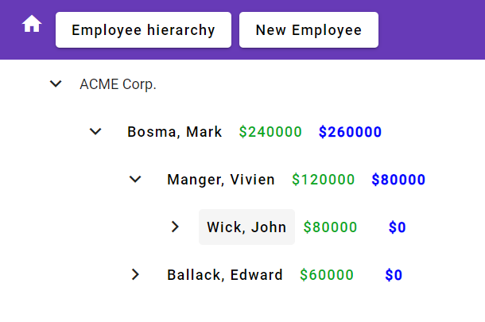
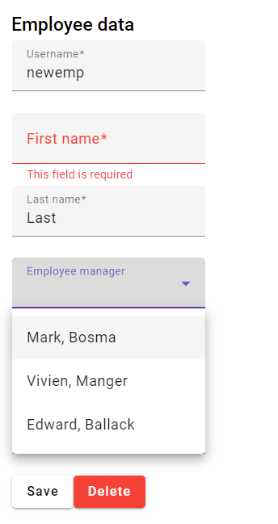
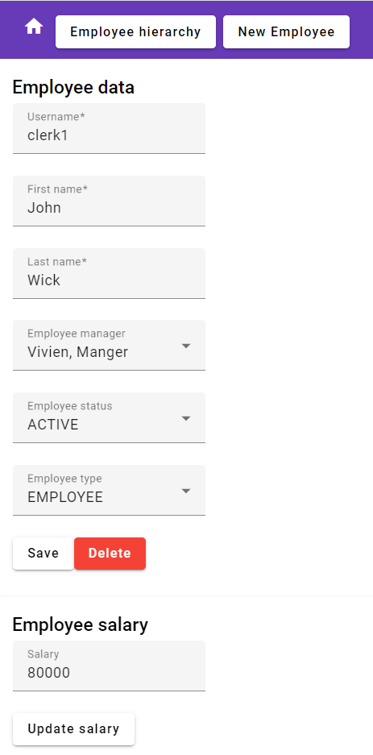
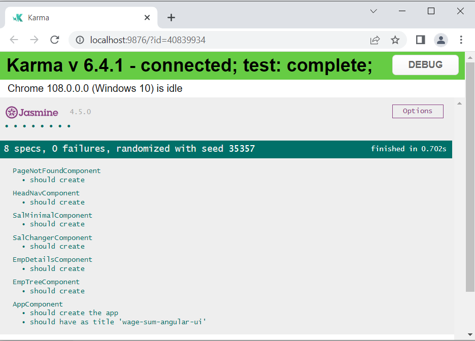

# WageSum Angular UI 

"Bonum vinum hedera non indiget" 

A latin mondás annyit jelent, hogy "Jó bornak nem kell cégér". Ezt az egyébként bölcs
mondást a marketingesek sokszor cáfolták már, így most inkább az utóbbiakra hallgatok. A backend
oldali fejlesztők, tervezők, architektek egyik legnagyobb rákfenéje, hogy sokszor
úgy definiálnak API-kat, hogy bár funkcionálisan megfelelő, de gyakorlatban nehezen 
használható végeredményt szülnek meg.

Ezt elkerülendő, néha nem árt átülni a másik oldalra is, a grafikus felületet készítők
szemszögéből is vizsgálni a végeredményt. Emellett így könnyebb "eladni" a backend
terméket cégen belül is.



Ennek örömére készítettem a [WageSum](https://github.com/lsmhun/wage-sum-server) 
microservice-nek egy Angular UI-t. Miért épp Angular? Vannak más framework-ok is, de 
ez az egyik legelterjedtebb (oké a react még inkább az, a flutter pedig nagyon 
pörög, arról is érdemes majd pár szót írni), felépítése hasonlít a 
Spring-hez, komoly támogatás van mögötte. [TypeScript](https://www.typescriptlang.org/)
nyelvet használ, ami a típusosságot kellően komolyan veszi. Sok-sok cikk született már 
erről, nem fejtegetem bővebben.

Személyes ok még az is, hogy még 2019-ben
készítettem egy pet projectet, amit máig (2022. december) lényegében néhány
"npm upgrade" paranccsal, különösebb változás nélkül lehetett naprakészen tartani.
Ezt azért kevés UI framework mondhatja el magáról.

Természetesen egy igazi UI specialista nagyon sok hibát, rossz gyakorlatot,
elavult elemet tudna találni. Jöhetnek a pull requestek. :)

# Fejlesztési napló

## 1. Project alapok
Kezdésnek fel kell tennünk a [NodeJS](https://nodejs.org/en/download/) aktuális verzióját,
majd telepíthetjük az Angular CLI csomagot is. Mindkettőt időről időre frissíteni kell,
de az "npm upgrade --force" és az "npm audit fix" (esetleg --force kapcsolóval) parancsok 
gyakori futtatása segít napra készen tartani. 

```shell
npm install -g @angular/cli

ng new wage-sum-angular-ui
```

Itt pár kérdésre válaszolni kell. Routing-ot szeretnénk használni, CSS helyett
SASS-t választottam, de igazán nem használtam semmi extrát. Már ebben az állapotban
el lehet indítani az alkalmazást a "ng serve -o" paranccsal.

Lehet a kedvenc IntelliJ Idea-t is használni, de a webes kiegészítő már fizetős,
így az ingyenes [Visual Studio Code](https://code.visualstudio.com/) néhány pluginnal 
( Angular Language Service, Sass extensions) elegendő a legtöbb igény kielégítésére.

Mivel vagyok jó designer, de azért szeretem, ha esztétikusan néz ki egy 
felület, ezért aztán a legismertebb design könyvtárat, a [Material](https://material.angular.io/)
design Angular komponenseit használom. Mint később látható, ezzel nagyon kényelmes
elérni a legtöbb funkcionalitást.
 
 ```shell
 ng add @angular/material
 
    ? Choose a prebuilt theme name, or "custom" for a custom theme: Deep Purple/Amber  [ Preview: https://material.angular.io?theme=deeppurple-amber ]
    ? Set up global Angular Material typography styles? No
    ? Include the Angular animations module? Include, but disable animations

    Please consider manually setting up the Roboto font.

# szeretne roboto font-ot is használni. Legyen akkor boldog:
npm install typeface-roboto --save
```
A generált HTML oldalt csupaszítsuk le,  hogy csak az 'App is running' felirat maradjon, 
majd a Material tesztelése végett tegyünk be egy mini kapcsolót. Ez persze pirosan
világít majd, mivel még _app.module.ts_ fájlban be kell húzni a _MatSlideToggleModule_ 
modult is. Ezek után már látszani fog a kis csúszókapcsoló.
 
```html
<mat-slide-toggle>Toggle me!</mat-slide-toggle> 
```
Annak érdekében, hogy még az "ng test" futására a Unit tesztek is túléljenek, 
bizonyos tesztelő importokat a teszt _app.component.spec.ts_ fájlban is fel kell venni. 

```typescript
import { MatSlideToggleModule } from '@angular/material/slide-toggle';

...
imports: [
        RouterTestingModule,
        MatSlideToggleModule
      ],
...
```	  
Remek, akkor már az alapokat le is tettük.

## 2. OpenAPI generation

A WageSum szerver oldalán már a kezdetekben definiáltuk a 
[WageSum OpenAPI](https://raw.githubusercontent.com/lsmhun/wage-sum-server/main/api/wagesum-openapi.yaml) 
leírót. Ebből elég könnyedén lehetséges TypeScript/Angular klienst generáltatni. 
Első lehetőség a rendes openapi docker image használata:

```shell
docker run --rm -v ${PWD}:/local openapitools/openapi-generator-cli generate -i https://raw.githubusercontent.com/lsmhun/wage-sum-server/main/api/wagesum-openapi.yaml  -g typescript-angular -o /local/build
```

Amennyiben nem szeretnénk külső generálót, használhatjuk erre npm csomagot is, ahogy
[ebben](https://mokkapps.de/blog/how-to-generate-angular-and-spring-code-from-open-api-specification/)
a leírásban is szerepel. 

```shell
npm add @openapitools/openapi-generator-cl
```

Itt kicsit lamentáltam, hogy on-the-fly generálás történjen-e, vagy inkább
snapshotok legyenek. Az életben nem szereti senki, ha a production build 
alatt változik meg az API definíciója. Amúgy erre (is) szolgálnak a 
[contract tesztek](https://github.com/lsmhun/demo-api-contract).

De most egyelőre ennek alkalmazásnak a generált kódja elfér a build könyvtárban, 
csak vegyük fel a _.gitignore_ fájlba is.

A [convention over configuration](https://en.wikipedia.org/wiki/Convention_over_configuration)
 nevében az npm esetén a [package.json](../package.json)-ban
lehet felvenni "script{ ... }" definíciókat, ahol ha a _pre_ vagy _post_ prefixet 
alkalmazod, akkor előtte/utána fog lefutni a kért parancs. Így felvettem 
ide a generálást, hogy mindig megtörténjen npm build/serve/test előtt.
Ez eléggé lassít, de legtöbbször úgyis az "ng serve -o" lesz futtatva.

```json
...
 "generate:api": "openapi-generator-cli generate -g typescript-angular -i https://raw.githubusercontent.com/lsmhun/wage-sum-server/main/api/wagesum-openapi.yaml -o ./build/openapi",
    "prestart": "npm run generate:api",
    "start": "ng serve",
...
```	
Ezek után már fel is vehetünk egy példa dolgozót a main komponensbe:

```typescript
import { Emp } from 'build/openapi/model/emp';
...
exampleEmp: Emp = {
    userName: "man1",
    firstName: "first",
    lastName: "last",
    empId: 2,
    mgrId: 1,
    status: Emp.StatusEnum.Active,
    type: Emp.TypeEnum.Manager
};

```


## 3. Váz kialakítása, routing 

Idáig eljutottunk, minden szuper, már sok minden megvan, de igazán még semmi.
Hozzuk létre akkor az alap komponenseinket. Lényegében az egész egy 
CRUD alkalmazás, aminek létezik dolgozói és fizetés kezelő REST
interfésze. 

Pár nézetünk lesz csak:
- fa nézet (emp-tree)
- dolgozó form (emp-details)
- 404 oldal (page-not-found)
- fejléc (head-nav) - nem kell routing hozza
- bejelentkező oldal (most ez még nem kell)

Ezekhez hozzuk létre a component eket.
```shell
ng generate component emp-tree
ng generate component emp-details
ng generate component emp-tree
ng generate component head-nav
```

Szükségünk lesz navigációra, amit legegyszerűbben az 
[Angular routing](https://angular.io/guide/router) megoldásával oldhatunk meg.
Az [AppRoutingModule](../src/app/app-routing.module.ts)-ba vegyük fel
az alap routing célokat.

 ```typescript
 const routes: Routes = [
  { path: 'emp-tree', title: 'Employee hierarchy', component: EmpTreeComponent },
  { path: 'emp/:id', title: 'Employee details', component: EmpDetailsComponent },
  { path: '',   redirectTo: '/emp-tree', pathMatch: 'full' }, // now redirect to `emp-tree`
  { path: '**', title: 'Page not found', component: PageNotFoundComponent },
];
```

A head-nav -ba vegyünk fel két linket elsőre, majd az app.component.html-ben az eddigi szöveget cseréljuk ki
csak ennyire:
 ```html
<app-head-nav></app-head-nav>
<router-outlet></router-outlet>
```

Remek, a routing már működik is, bár az alap két tesztünket elrontottuk. 
A hibaüzenetek alapján ezt gyorsan javíthatjuk is. Sok minden még nem történik, 
de már tudunk váltogatni oldalak között.

Azért, hogy  Material-hoz tartozó elemek egy helyen legyenek gyűjtve, ezért 
ezeket a [material.modules.ts](../src/material.modules.ts)-ben definiáljuk. 
Ezek után az _app.module.ts_-ben már csak ezt a "gyűjtő" modult kell behúzni
és már használhatjuk is a komponenseket. Jogos felvetés, hogy ha így teszünk,
akkor sok felesleges komponens is bekerül. Szerencsére, amikor a végső shuffle
zajlik majd, akkor van olyan okos a fordító, hogy a nem használt elemeket kiszedi 
a végeredményből.

Először a app-head-nav nál érdemes kipróbálni, hogy megy-e. Aztán jöhet a többi.
A következő az dolgozói adat form lehet. Elsőre nem a szépség a fő cél, csak látsszon valami,
de már material design-nal.



Amikor routing már működni kezd, akkor szeretnénk például az _empId_ paramétert megkapni.
Erre a @Input annotáció szolgál, de null-safety kapcsán kicsit enyhíthető a szigor, mint
ahogy 
[itt](https://stackoverflow.com/questions/49699067/property-has-no-initializer-and-is-not-definitely-assigned-in-the-construc)
javasolják is. A [tsconfig.json](../tsconfig.json) fájlban _"compilerOptions": {"strictPropertyInitialization": false, ..}_
segítségével áthidalhatjuk a kérdést. 


## 5. Környezetek, fa nézet, dolgozó editor

A fa nézet létrehozásához egy az egyben a 
[Tree with dynamic data](https://material.angular.io/components/tree/examples#tree-dynamic)
mintát vettem át, csak a statikus repository helyett már az OpenApi generált service-eket
használatam, amint az [emp-tree.component.ts](../src/app/emp-tree/emp-tree.component.ts)-ben 
látható is.

Ezen a ponton már elkerülhetetlen valódi HTTP kérések küldése. 
A [WageSum](https://github.com/lsmhun/wage-sum-server) szerver futtatása nem 
fogyasztott sokat, plusz ott is előkerült pár bug.

A környezetek definiálása nem megkerülhető ezen a ponton, mivel 
fejlesztéshez tökéletesen elég a 127.0.0.1 cím, de production már mást kérhet.
Erre [build guide](https://angular.io/guide/build) ad mintát, és ettől kezdve
"ng serve --configuration=development -o" paranccsal tudjuk futtatni az
alkalmazást. 

A [CORS](https://en.wikipedia.org/wiki/Cross-origin_resource_sharing) miatt szükség
proxy beállításra is. Ehhez én [ezt](https://jmrobles.medium.com/mastering-angular-proxy-configuration-6c8df0b175fe)
a cikket használtam mankónak. Mivel a környezetek között már felvettük a BASE_PATH értéket
a kívánságunknak megfelelően, de ezt még az [app.module.ts](../src/app/app.module.ts) -ben
a providerek közé fel kell venni, hogy a generált module ennek megfelelő URL-re hívjon
tovább. 
```typescript
  providers: [{ provide: BASE_PATH, useValue: environment.API_BASE_PATH }],
```
Ha Chrome-ban a debug oldalt nézzük, már látható, hogy a kérések ettől kezdve a "/api" címre fognak 
beérkezni, amit a proxy modul fog továbbítani a tényleges, BASE_PATH-ban
beállított cím felé. 



A dolgozói form miatt a _FormsModule_-ra is szükségünk lesz, de egyébként itt is 
maradtam a [legegyszerűbb](https://material.angular.io/components/form-field/overview#form-field-overview)
form megoldásnál. Validációból kéne jóval több, de az alap látható.

Két érdekes hibába futottam bele. Az egyik, hogy ha már ki van választva egy dolgozónk, 
akkor sajnos nem veszi fel a routing változást (például az új dolgozó felvételére kattintva). 
Erre megoldásként feliratkoztam már a constuctorban  a route változásokra,
ahogy [itt](https://stackoverflow.com/questions/47577047/angular-route-id-change-updating-reactive-form-state) és
[itt](https://stackoverflow.com/questions/33520043/how-to-detect-a-route-change-in-angular)
javasolják.

A másik érdekesség az animációknál ért. Mivel egy-egy kérés akár sokáig is futhat,
ezért ilyenkor egy "loading" ikont érdemes kirakni, hogy a felhasználó tudja, hogy 
működünk, csak várunk a backend válaszára. Erre vannak szép 
[mat-progress-spinner](https://material.angular.io/components/progress-spinner/overview)
elemek, csak sajnos nem forogtak. Aztán jött a 
[megvilágosodás](https://stackoverflow.com/questions/62572985/angular-material-spinner-does-not-spin), hogy 
a kezdet kezdetén _NoopAnimationsModule_ lett kiválasztva, amit le kell cserélni
_BrowserAnimationModule_-ra, ha mozgást is szeretnénk látni. 

## 6. Fizetéshez kapcsolódó elemek

Mostanra már működnek a dolgozói CRUD funkciók, most meg kéne mutatni a 
a fizukat és a bértömeget is. Végülis ezért született az egész.

Ehhez egy nagyon egyszerű, minimalista komponens is elég, amit az 
[emp-tree.component.html](../src/app/emp-tree/emp-tree.component.html)-be beillesztve
már láthatjuk is az eredményt. 
Az dolgozói formhoz képest annyi a különbség, hogy itt átadjuk az empId paramétert a @Input -tal, 
nem a routingból érkezik.

Emellett kell a fizetés update-hez is egy kisebb fizetés
változtató [komponens](../src/app/sal-changer/sal-changer.component.ts),
ami majdnem ugyanaz, mint a dolgozói adatok változtatása, 
csak a salary REST interfészt hívogatja. 

## 7. Tesztek fixálása

Amint észre lehetett venni, a [TDD](https://en.wikipedia.org/wiki/Test-driven_development)
kicsit háttérbe szorult. Legalább a minimális unit teszteket 
újra életre kéne lehelni, hogy később akár bővíteni lehessen.

Ennek érdekében pár teendőnk azért akad.

Az egyik, hogy a UsedMaterialModules üt be kell húzni a tesztekbe is.
Ez persze lustaság, mert nem mindegyik module-t használjuk, 
élesben nyilván mindegyik tesztnél csak az abban a komponensben használt
elemeket importáljuk, ezzel gyorsabb is lesz.. Ahol használjük, 
ott ne felejtsük el a _FormsModule_ és _BrowserAnimationsModule_ elemeket sem.

A másik sarkalatos pont a mocking and dependency injection. A legtöbb
példa a [emp-details.component.spec.ts](../src/app/emp-details/emp-details.component.spec.ts)
esetén megfigyelhető.

Egyik első lényeges lépés a _HttpClientTestingModule_ import. 
Ez nagyon okos kis tesztelő module, megoldja a hianyzó _HttpClient_ dependecy injektálást.

Mivel az Angular alapból az [RxJS](https://angular.io/guide/rx-library) 
library segítségével éri el az aszinkron és reaktív működést, ezért
érdemes ennek jobban is utánaolvasni. 
A tesztek esetén is _Observable<>_ definíciókra lesz szükségünk.

Az egyes hívásokat ezek után a _spyOn()_ metódussal, 
[fluent](https://en.wikipedia.org/wiki/Fluent_interface) formában lehet
a választ emulálni.

```typescript
    // given salService
    const salService = TestBed.inject(SalService);
    const httpEventSal: HttpEvent<string> = new HttpResponse<string>({ body: "123" });
    spyOn(salService, 'getSalByEmpId').and.returnValue(of(httpEventSal));
```

A sorrend fontos: előbb kell legyen az instance  _TestBed.configureTestingModule()_l és csak utána
lehet injektálni, meg spyOn()-t használni.



Tegyünk fel egy lint -et is, ami segít kitakarítani a kódot. Amikor először próbáljuk 
meg futtatni, akkor felkínál ESLint-et, de bármelyik másik is választható. 
```shell
ng lint --fix
```
A fejlesztés során is automatizáltan érdemes ezeket alkalmazni. Most csak
utólagos takarításra használtam.
 
## 8. Dockerizálás
A konténerek használata minden microservice-nek része.
[Angular alkalmazás dockerizálása](https://medium.com/codex/dockerize-angular-application-69e7503d1816)
témában rengeteg példa elérhető. Az alkalmazott eset előbb 
az "npm build" segítségével legyártja a _dist_ könyvtárba a production
ready kódot, majd egy ngix konténerhez hozzáadja. 

Rengeteg ideig fut, kihajtja napjaink csúcsgépeit is. 
Helyette lehet lokálisan buildelni egy "npm run build --prod" 
paranccsal egy normál kimenetet és ehhez gyártani egy másik 
Dockerfile-t.  

```shell
docker build -t lsmaster/wage-sum-angular-ui:0.0.1 .
```


